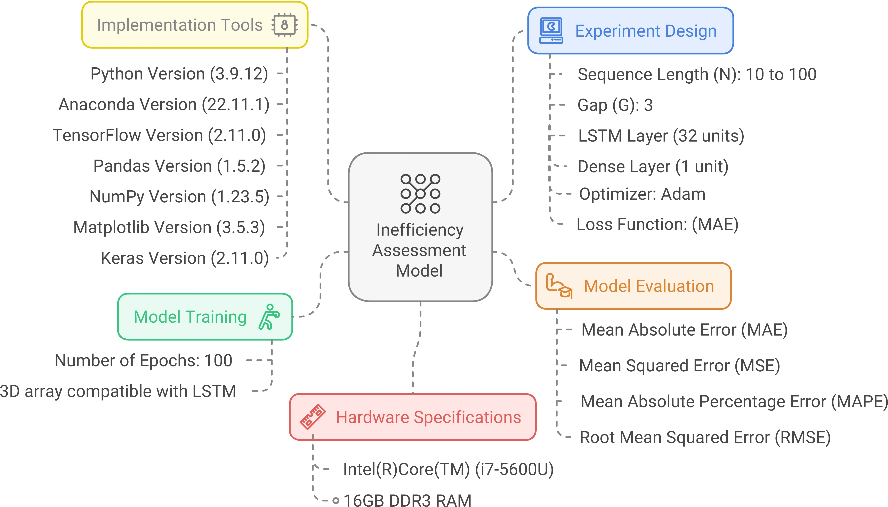

<h2> <a href="https://semarakilmu.com.my/journals/index.php/applied_sciences_eng_tech/article/view/1477" target="_blank">LSTM Inefficiency in Long-Term Dependencies Regression Problems</a></h2>
<hr>
<a href="https://semarakilmu.com.my/journals/index.php/applied_sciences_eng_tech/article/view/1477" target="_blank">
    
</a>
	
</br></br>
<div align="center">
    
</div>

## Abstract
Recurrent neural networks (RNNs) are an excellent fit for regression problems where sequential data are the norm since their recurrent internal structure can analyze and process data for long. However, RNNs are prone to the phenomenal vanishing gradient problem (VGP) that causes the network to stop learning and generate poor prediction accuracy, especially in long-term dependencies. Originally, gated units such as long short-term memory (LSTM) and gated recurrent units (GRU) were created to address this problem. However, VGP was and still is an unsolved problem, even in gated units. This problem occurs during the backpropagation process when the recurrent network weights tend to vanishingly reduce and hinder the network from learning the correlation between temporally distant events (long-term dependencies), that results in slow or no network convergence. This study aims to provide an empirical analysis of LSTM networks with an emphasis on inefficiency in long-term dependencies convergence because of VGP. Case studies on NASA’s turbofan engine degradation are examined and empirically analyzed.

## Keywords: 
Recurrent Neural Networks, regression problems, Vanishing Gradient Problem, Long Short-Term Memory, long-term dependencies

## URL: 
[Read the full paper](https://semarakilmu.com.my/journals/index.php/applied_sciences_eng_tech/article/view/1477)

## Please consider a citation:
Safwan Mahmood Al-Selwi, Mohd Fadzil Hassan, Said Jadid Abdulkadir, & Amgad Muneer. (2023). LSTM Inefficiency in Long-Term Dependencies Regression Problems. Journal of Advanced Research in Applied Sciences and Engineering Technology, 30(3), 16–31. https://doi.org/10.37934/araset.30.3.1631

## BibTeX:
```
@article{SafwanAlselwi2023LSTM_Inefficiency, 
	author={Safwan Mahmood Al-Selwi and Mohd Fadzil Hassan and Said Jadid Abdulkadir and Amgad Muneer}, 
	title={LSTM Inefficiency in Long-Term Dependencies Regression Problems}, 
	volume={30}, 
    DOI={10.37934/araset.30.3.1631},	
    url={https://semarakilmu.com.my/journals/index.php/applied_sciences_eng_tech/article/view/1477}, 
	journal={Journal of Advanced Research in Applied Sciences and Engineering Technology}, 
	year={2023}, 
	month={05}, 
	pages={16–31}
}
```

## Corresponding author
Safwan Mahmood Al-Selwi
<br>safwan_21002827@utp.edu.my

<br>Thank you
